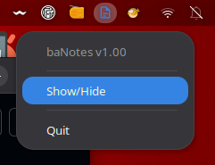
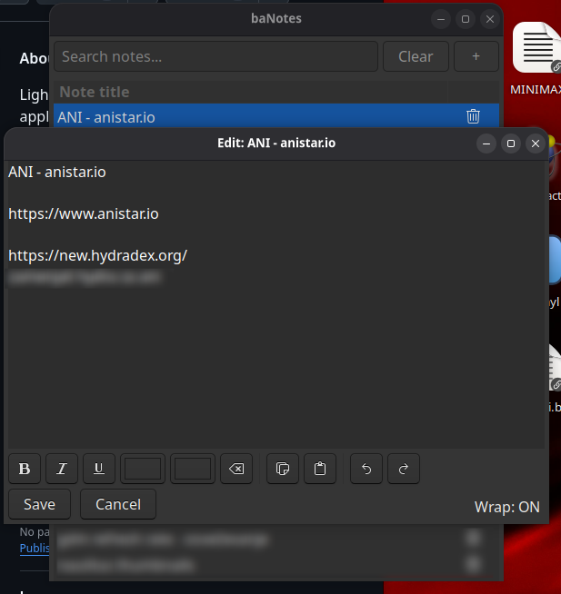
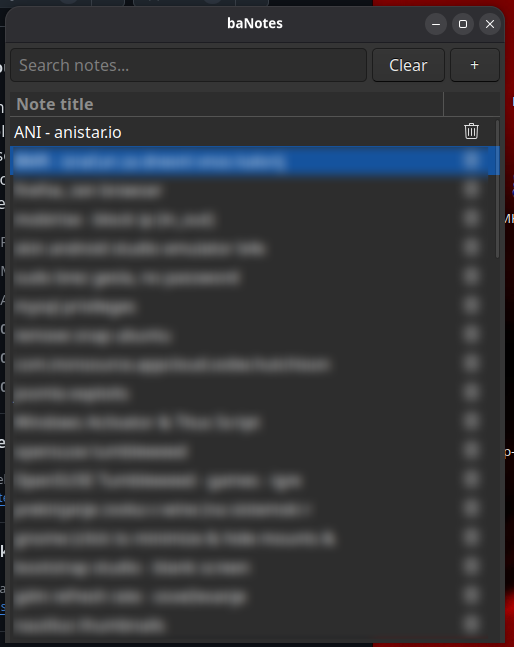

# baNotes

Lightweight GTK note-taking application. Stores notes as text files in a user configuration directory and exposes a tray indicator for quick access.

Build and install

Dependencies (typical on Debian/Ubuntu):

- `libgtk-3-dev`
- `libayatana-appindicator3-dev` (or distribution-specific AppIndicator dev package)
- `pkg-config`

To build and install:

```bash
make
sudo make install
```

Usage

- Run `baNotes` after installation or start from your desktop environment. The app stores notes in `.txt` files located in a user configuration directory. Files are either plain text or encoded in the BA-RICH-V1 "enriched" format (used to persist editor formatting).
- Use the folder selector to switch folders, the folder button to create a subfolder inside the current folder, and the plus button to create a note in the selected folder. Folder rows are always shown above note rows and use a separate text color. Right-click a folder to rename or delete it; deleting a non-empty folder displays an explicit warning. Double-click `..` to go to the parent folder. Select multiple rows with `Ctrl+A` and drag them onto a folder or `..` to move them. Folder nesting is unlimited and is stored under `~/.config/baNotes/notes`.
- Search is case-insensitive and searches folder names, note titles, and note contents recursively below the current folder. Only matching folders and notes, including the folder path leading to a matching note, remain visible.

Screenshots

- 
- 
- 

License

This project is licensed under the MIT License. See `LICENSE` for details.

Authors

- BArko
- SimOne (AI assistant, co-developer)
